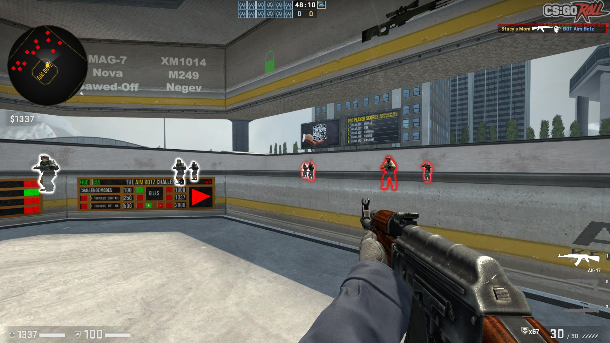

# WhateverYouWant (WYW) CS:GO cheat

A cheat for the video game Counter-Strike: Global Offensive.
Named WhateverYouWant since when I asked my friend what to name the cheat, he replied with "whatever you want".
The offsets are accurate as of 30/7/20 and all cheats work as intended.

## WARNING AND DISCLAIMER
It has never been tested on VAC-secured servers and is probably not safe to use in VAC-secured servers.
Do not use this on VAC-secured servers. My cheat has absolutely no anti-cheat circumvention.
If you get banned using this, that is completely your fault.

## Features
- Bunnyhop - press Space to automatically jump and gain acceleration
- Triggerbot - hold Mouse4 to automatically shoot when your crosshair is on an enemy
- GlowESP - enemies are automatically highlighted through walls
- NoFlash - removes flash

Preview:


## Updating Offsets

New updates to the game can break the code since I have not bothered to implement pattern scanning.
In this case, you can manually update the code using the offsets from [hazedumper](https://github.com/frk1/hazedumper).
Copy and paste the contents of the ```csgo.hpp``` file into the one in this program.

